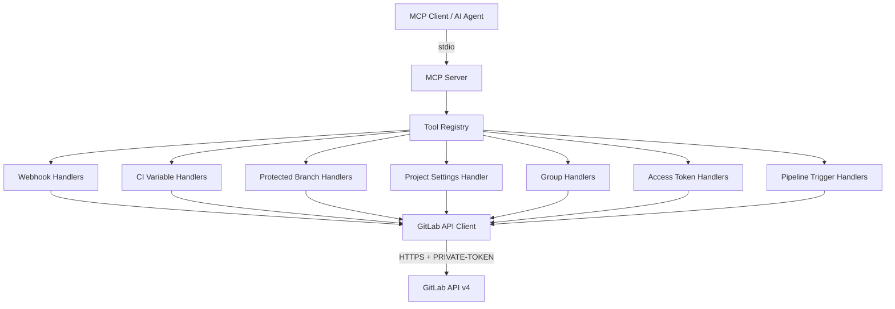

# Design Document: gitlab-ops-mcp-server

## Overview

gitlab-ops-mcp is a Node.js/TypeScript MCP server that exposes 21 tools across 7 GitLab operational domains as thin REST wrappers around GitLab API v4. The server uses `@modelcontextprotocol/sdk` for MCP protocol handling and communicates via stdio transport. It is stateless — every tool invocation maps to a single GitLab API call with no local persistence.

The architecture follows a layered approach: MCP SDK handles protocol framing, a tool registry maps tool names to handlers, each handler validates inputs and delegates to a shared API client, and the API client manages authentication and HTTP communication with GitLab.

## Architecture



The server starts by reading environment variables, creating the API client, registering all tool handlers with the MCP SDK, and connecting via stdio. Each tool handler is a pure function: validate inputs → build request → call API client → format response.

## Components and Interfaces

### 1. Entry Point (`src/index.ts`)

Responsible for:
- Reading `GITLAB_PERSONAL_ACCESS_TOKEN` and `GITLAB_API_URL` from `process.env`
- Exiting with error if token is missing; defaulting API URL to `https://gitlab.com/api/v4`
- Creating the `GitLabApiClient` instance
- Creating the MCP `Server` instance and registering all tools
- Connecting via `StdioServerTransport`

### 2. GitLab API Client (`src/gitlab-client.ts`)

A thin HTTP client wrapping `fetch` (Node 18+ built-in).

```
interface GitLabApiClient {
  get<T>(path: string, params?: Record<string, string>): Promise<T>
  post<T>(path: string, body: Record<string, unknown>): Promise<T>
  put<T>(path: string, body: Record<string, unknown>): Promise<T>
  delete(path: string): Promise<void>
}
```

- Prepends `GITLAB_API_URL` to all paths
- Attaches `PRIVATE-TOKEN` header to every request
- Sets `Content-Type: application/json` for POST/PUT
- Throws a `GitLabApiError` on non-2xx responses, capturing status code and response body
- Throws a `GitLabConnectionError` on network failures

### 3. Tool Handlers (`src/tools/*.ts`)

One file per domain, each exporting a `register` function:

| File | Tools | GitLab API Base |
|------|-------|-----------------|
| `src/tools/webhooks.ts` | create, list, update, delete, test | `/projects/:id/hooks` |
| `src/tools/ci-variables.ts` | create, list, update, delete | `/projects/:id/variables` |
| `src/tools/protected-branches.ts` | protect, list, unprotect | `/projects/:id/protected_branches` |
| `src/tools/project-settings.ts` | update | `/projects/:id` |
| `src/tools/groups.ts` | create, list, delete | `/groups` |
| `src/tools/access-tokens.ts` | create, list, revoke | `/projects/:id/access_tokens` |
| `src/tools/pipeline-triggers.ts` | create, list, delete | `/projects/:id/triggers` |

Each register function receives the MCP `Server` instance and the `GitLabApiClient`, then calls `server.tool()` for each tool in its domain.

Each tool handler:
1. Validates required inputs using a shared validation utility
2. Validates enum values where applicable (e.g. `variable_type`, `visibility`, `merge_method`, `squash_option`)
3. Constructs the API path and request body
4. Calls the appropriate API client method
5. Returns the result as MCP text content

### 4. Validation Utilities (`src/validation.ts`)

Shared input validation helpers:

```
function requireParam(params: Record<string, unknown>, name: string): unknown
function requireString(params: Record<string, unknown>, name: string): string
function requireNumber(params: Record<string, unknown>, name: string): number
function optionalString(params: Record<string, unknown>, name: string): string | undefined
function optionalNumber(params: Record<string, unknown>, name: string): number | undefined
function optionalBoolean(params: Record<string, unknown>, name: string): boolean | undefined
function requireEnum<T extends string>(params: Record<string, unknown>, name: string, values: T[]): T
function optionalEnum<T extends string>(params: Record<string, unknown>, name: string, values: T[]): T | undefined
function optionalStringArray(params: Record<string, unknown>, name: string): string[] | undefined
```

Throws a `ValidationError` with a descriptive message when validation fails.

### 5. Error Handling (`src/errors.ts`)

Custom error classes:

```
class GitLabApiError extends Error {
  statusCode: number
  gitlabMessage: string
}

class GitLabConnectionError extends Error {
  cause: Error
}

class ValidationError extends Error {
  paramName: string
}
```

The tool handler wrapper catches these and maps them to MCP error responses:
- `ValidationError` → MCP error with missing/invalid parameter description
- `GitLabApiError` → MCP error with HTTP status and GitLab error message
- `GitLabConnectionError` → MCP error indicating connectivity failure

### 6. Tool Registration Index (`src/tools/index.ts`)

Aggregates all domain register functions into a single `registerAllTools(server, client)` call.

## Data Models

The server does not define its own domain models. GitLab API responses are passed through as JSON. Tool inputs are validated at the handler level using the validation utilities.

### Tool Input Schemas

Each tool declares its input schema via the MCP SDK's `server.tool()` registration using Zod schemas. These schemas serve as the first line of validation (MCP SDK validates before the handler runs).

Key input types across tools:

| Parameter | Type | Used By |
|-----------|------|---------|
| `project_id` | string or number | All project-scoped tools |
| `hook_id` | number | update_webhook, delete_webhook, test_webhook |
| `key` | string | CI variable tools |
| `group_id` | number | delete_group |
| `token_id` | number | revoke_project_access_token |
| `trigger_id` | number | delete_pipeline_trigger |
| `name` | string | protect_branch, unprotect_branch, create_group, create_project_access_token |
| `url` | string | create_webhook |
| `scopes` | string[] | create_project_access_token |
| `visibility` | enum | create_group |
| `merge_method` | enum | update_project_settings |
| `squash_option` | enum | update_project_settings |
| `variable_type` | enum | create_ci_variable |

### Response Format

All tools return MCP text content containing the JSON-serialised GitLab API response. For delete operations, a confirmation object `{ "status": "success" }` is returned.


## Correctness Properties

*A property is a characteristic or behaviour that should hold true across all valid executions of a system — essentially, a formal statement about what the system should do. Properties serve as the bridge between human-readable specifications and machine-verifiable correctness guarantees.*

The prework analysis identified that the 21 tool handlers all follow the same structural pattern: validate inputs → call correct HTTP method on correct endpoint → return response. This allows consolidation into a small number of high-value properties rather than 21 repetitive ones.

### Property 1: Tool-to-API request mapping

*For any* tool invocation with valid inputs, the Tool_Handler SHALL send a request using the correct HTTP method (GET, POST, PUT, or DELETE) to the correct GitLab API path, with the correct request body constructed from the tool's input parameters.

This is the core property of the entire server. Each of the 21 tools is a thin mapping from MCP tool invocation to GitLab REST call. We can generate random valid inputs for any tool and verify that the API client receives the expected method, path, and body.

**Validates: Requirements 2.1, 2.2, 2.3, 2.4, 2.5, 3.1, 3.2, 3.3, 3.4, 4.1, 4.2, 4.3, 5.1, 6.1, 6.2, 6.3, 7.1, 7.2, 7.3, 8.1, 8.2, 8.3**

### Property 2: Authentication header inclusion

*For any* request made by the API_Client to the GitLab_API, the request SHALL include a `PRIVATE-TOKEN` header whose value equals the configured `GITLAB_PERSONAL_ACCESS_TOKEN`.

This property operates at the API client layer. We can generate random API calls (any method, any path) and verify the header is always present and correct.

**Validates: Requirements 1.5**

### Property 3: Required parameter validation

*For any* tool and *for any* required parameter of that tool, invoking the tool with that parameter missing or of an incorrect type SHALL produce a validation error naming the missing/invalid parameter, and SHALL NOT make any request to the GitLab_API.

This consolidates missing-parameter and type-checking validation into one property. We can enumerate all tools and their required params, then for each combination, omit or mistype the param and verify the error.

**Validates: Requirements 9.2, 10.1**

### Property 4: Enum parameter validation

*For any* tool with enum-constrained parameters and *for any* string value not in the allowed set, invoking the tool with that invalid enum value SHALL produce a validation error, and SHALL NOT make any request to the GitLab_API.

The enum-constrained parameters are: `variable_type` (env_var, file), `visibility` (private, internal, public), `merge_method` (merge, rebase_merge, ff), and `squash_option` (default_off, default_on, always, never). We can generate random strings outside each allowed set and verify rejection.

**Validates: Requirements 10.2, 10.3, 10.4, 10.5**

### Property 5: HTTP error propagation

*For any* tool invocation where the GitLab_API returns a non-2xx HTTP status, the Tool_Handler SHALL return an MCP error response containing both the HTTP status code and the error message from the response body.

We can generate random HTTP error statuses (400-599) with random error messages, mock the API client to return them, and verify the MCP error response contains both pieces of information.

**Validates: Requirements 9.1**

## Error Handling

Error handling follows a layered approach:

1. **Validation layer** (`src/validation.ts`): Catches missing/invalid parameters before any HTTP call. Throws `ValidationError`.

2. **API client layer** (`src/gitlab-client.ts`): Catches HTTP errors and network failures. Throws `GitLabApiError` (non-2xx responses) or `GitLabConnectionError` (network unreachable/timeout).

3. **Tool handler wrapper**: A shared wrapper function catches all error types and maps them to MCP error responses:
   - `ValidationError` → `{ isError: true, content: [{ type: "text", text: "Validation error: <param> is required" }] }`
   - `GitLabApiError` → `{ isError: true, content: [{ type: "text", text: "GitLab API error <status>: <message>" }] }`
   - `GitLabConnectionError` → `{ isError: true, content: [{ type: "text", text: "GitLab connection error: <details>" }] }`
   - Unknown errors → `{ isError: true, content: [{ type: "text", text: "Unexpected error: <message>" }] }`

This ensures no unhandled exceptions escape to the MCP transport and every error produces a meaningful, structured response.

## Testing Strategy

### Property-Based Testing

Use `fast-check` as the property-based testing library. Each correctness property maps to one or more property-based tests with a minimum of 100 iterations.

**Property test approach:**
- Mock the `GitLabApiClient` to capture outgoing requests (method, path, body, headers)
- Generate random valid inputs for each tool using fast-check arbitraries
- Verify the captured request matches the expected API call
- For error properties, mock the API client to return errors and verify MCP error responses

**Tag format:** `Feature: gitlab-ops-mcp-server, Property N: <property text>`

### Unit Testing

Use `vitest` as the test runner. Unit tests complement property tests by covering:

- Specific examples for each tool (happy path with realistic GitLab data)
- Edge cases: empty strings, boundary values for access levels, missing optional params
- Server initialisation: missing token exits, missing URL defaults
- Network error simulation for connectivity failure handling
- Integration between validation layer and tool handlers

### Test Organisation

```
tests/
  gitlab-client.test.ts       — API client unit tests (auth header, error mapping)
  validation.test.ts           — Validation utility unit tests
  tools/
    webhooks.test.ts           — Webhook handler tests
    ci-variables.test.ts       — CI variable handler tests
    protected-branches.test.ts — Protected branch handler tests
    project-settings.test.ts   — Project settings handler tests
    groups.test.ts             — Group handler tests
    access-tokens.test.ts      — Access token handler tests
    pipeline-triggers.test.ts  — Pipeline trigger handler tests
  properties/
    tool-api-mapping.prop.ts   — Property 1: tool-to-API mapping
    auth-header.prop.ts        — Property 2: auth header inclusion
    required-params.prop.ts    — Property 3: required param validation
    enum-validation.prop.ts    — Property 4: enum validation
    error-propagation.prop.ts  — Property 5: HTTP error propagation
```

### Test Dependencies

- `vitest` — test runner
- `fast-check` — property-based testing
- No HTTP mocking library needed — the `GitLabApiClient` is injected into handlers, so we mock it directly via a simple test double
